# Lesson Structure Visualization

## Hierarchical Structure

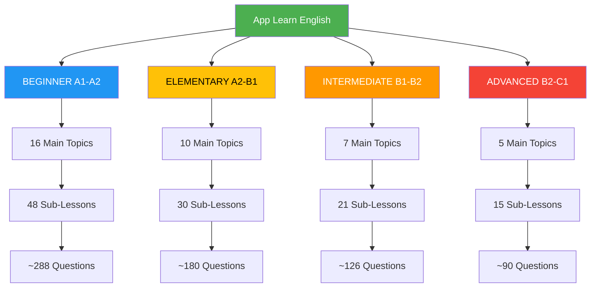

## Question Type Distribution

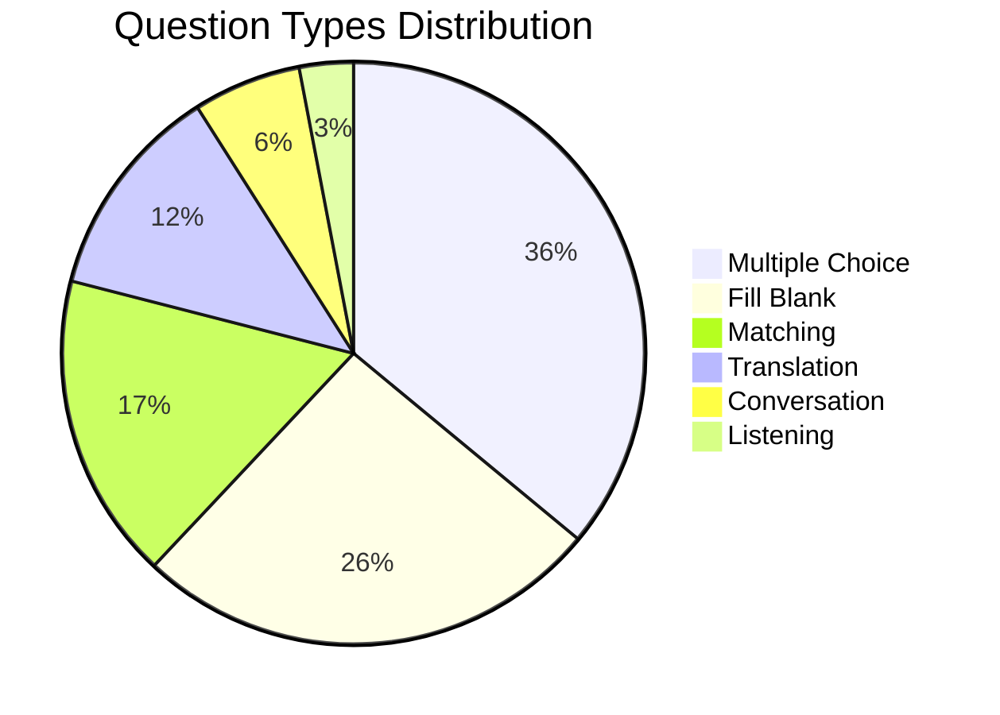

## Data Flow

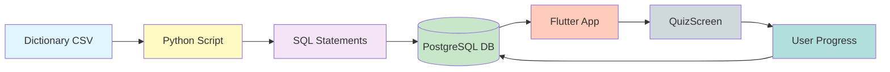

## Beginner Topics Overview

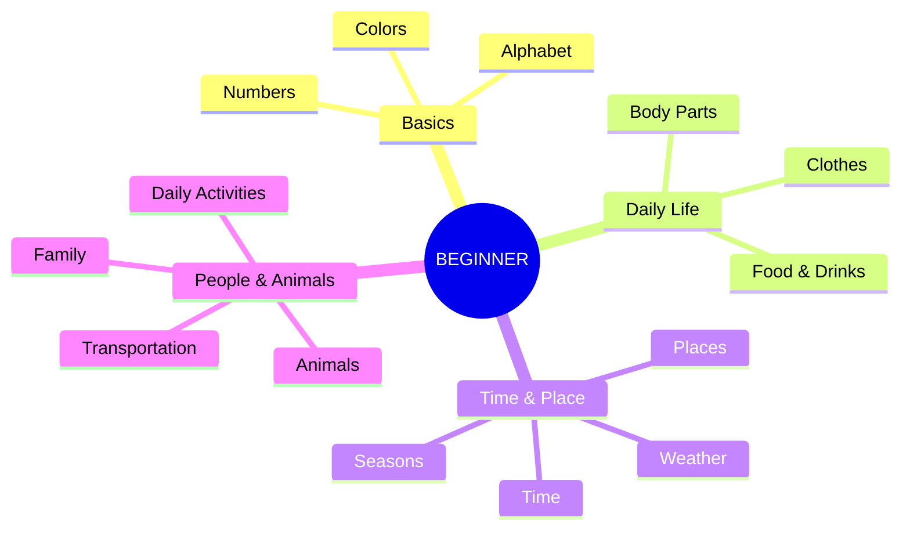

## Elementary Topics Overview

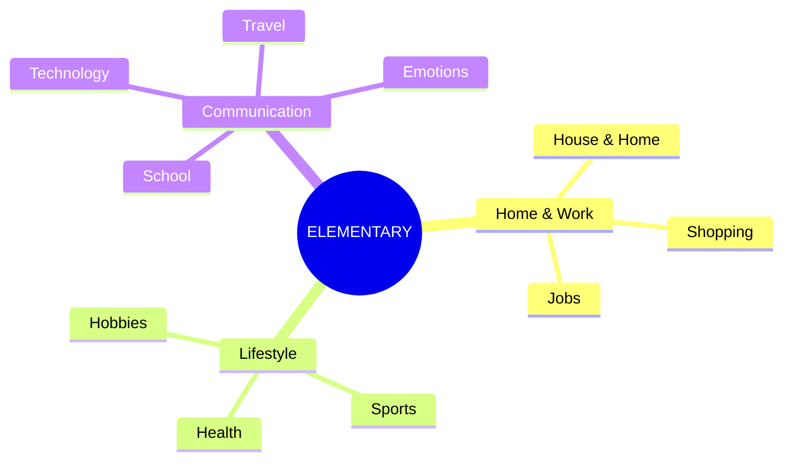

## Intermediate Topics Overview

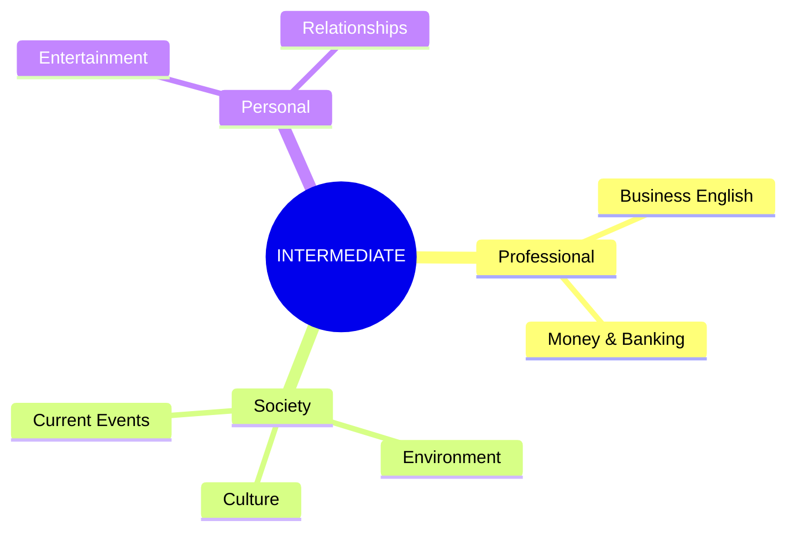

## Advanced Topics Overview

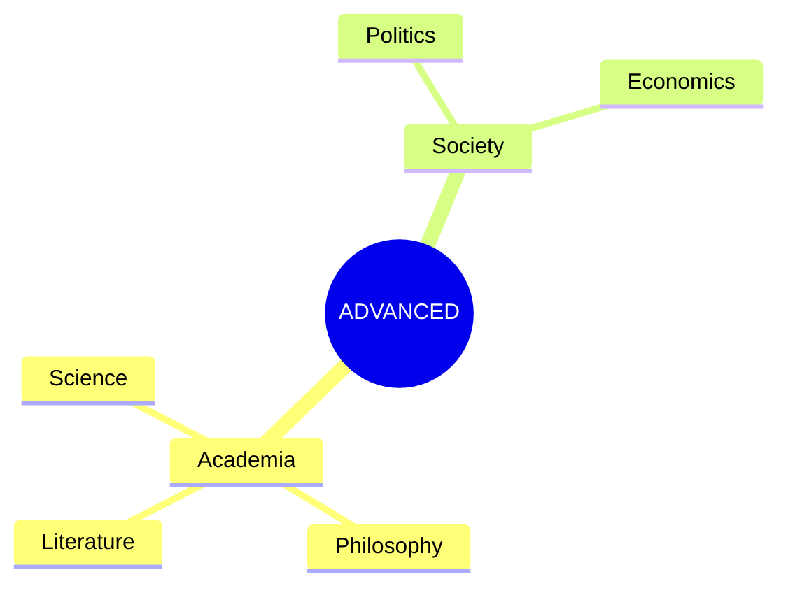

## Lesson to Questions Flow

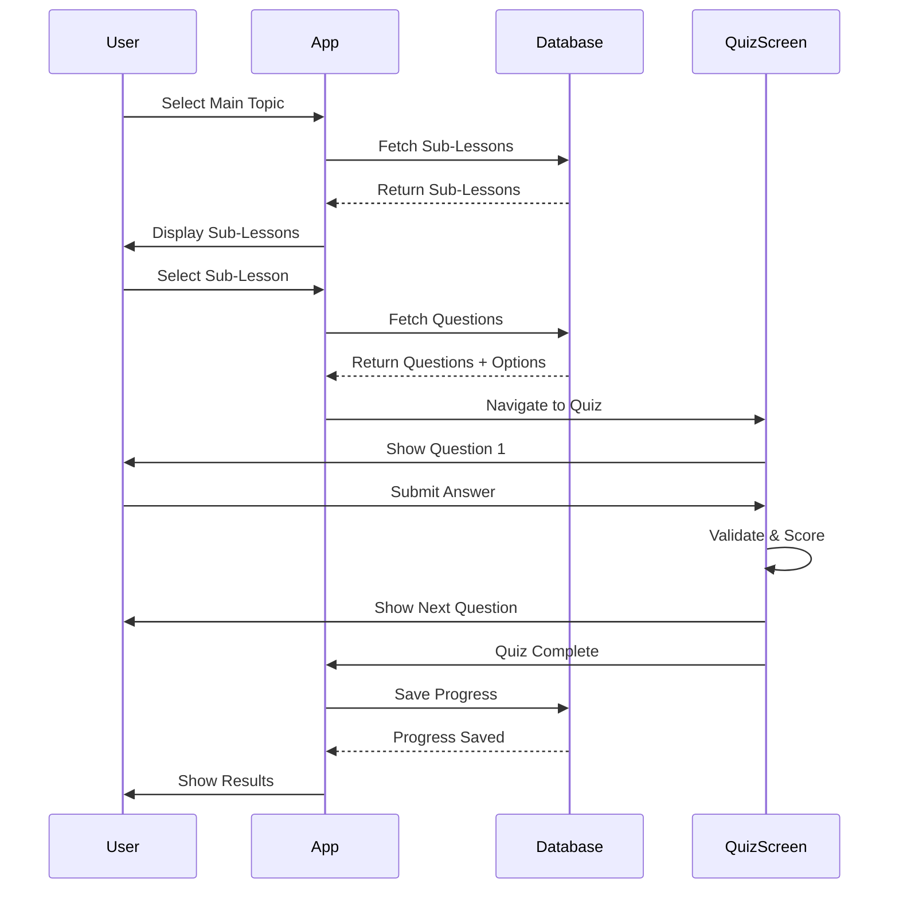

## Database Schema Relationships

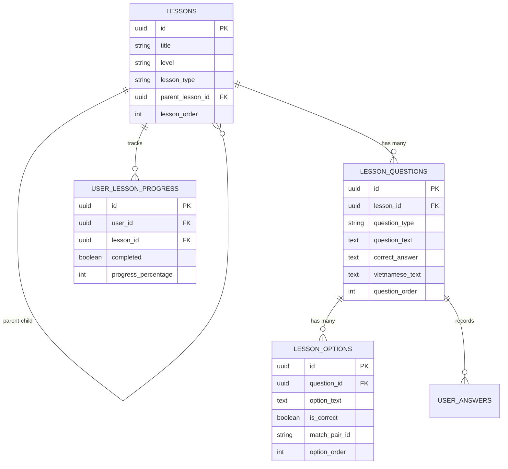

## Question Type Implementation

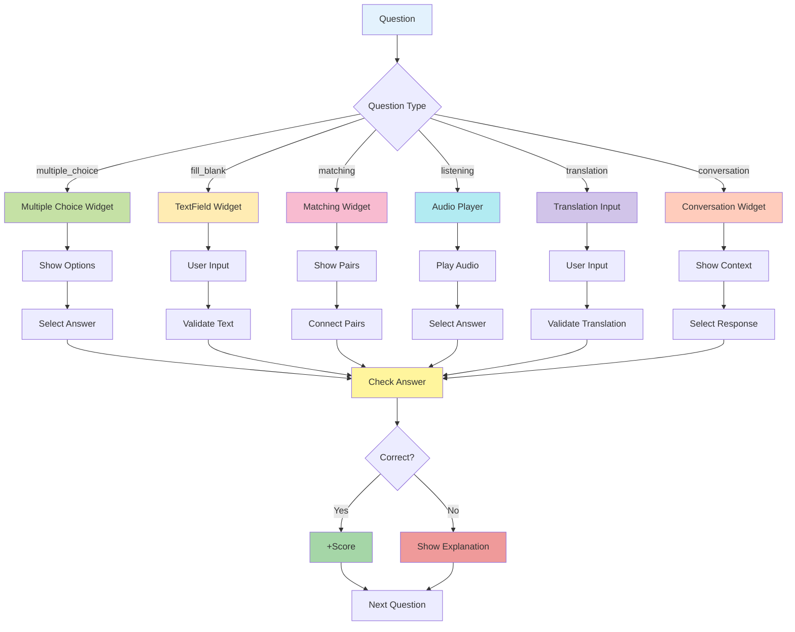

## Dictionary Integration

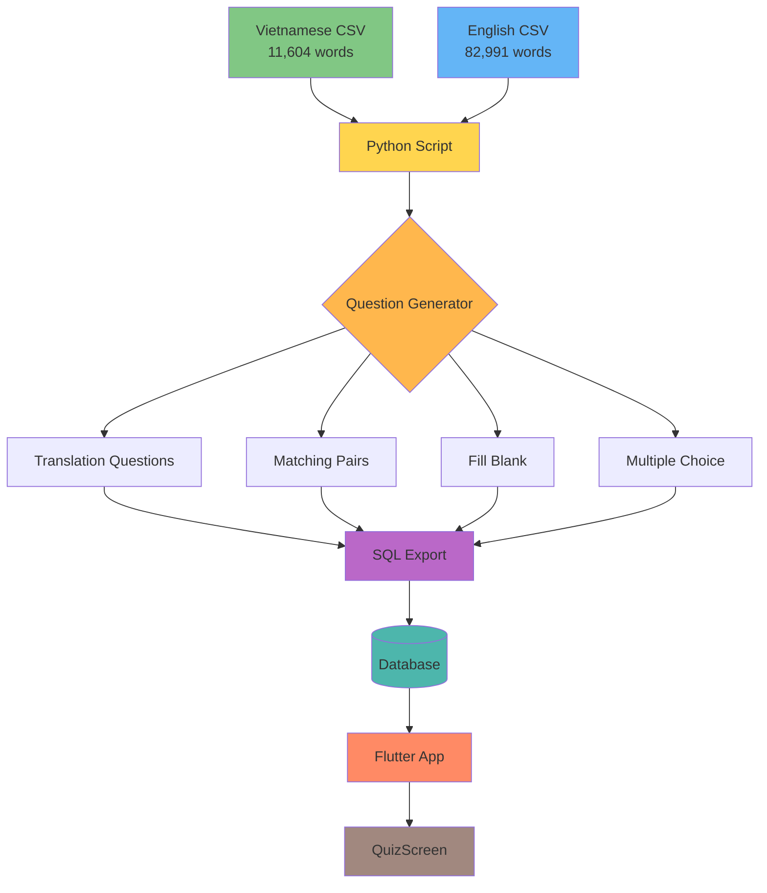

## Progress Tracking Flow

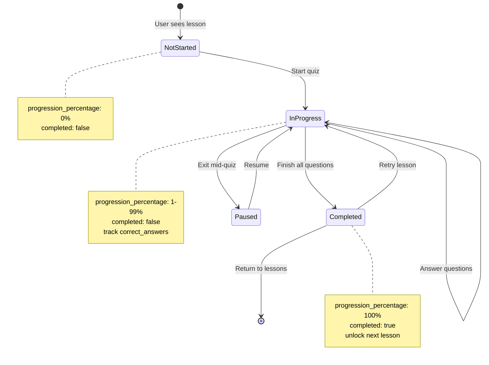

---

## Legend

### Colors by Level
- 🟢 **Beginner (A1-A2)** - Blue
- 🟡 **Elementary (A2-B1)** - Yellow
- 🟠 **Intermediate (B1-B2)** - Orange
- 🔴 **Advanced (B2-C1)** - Red

### Question Type Icons
- ✅ Multiple Choice
- ✏️ Fill in the Blank
- 🔗 Matching
- 🎧 Listening
- 🌐 Translation
- 💬 Conversation

---

*This visualization helps understand the complete structure of 114 lessons and their relationships.*
